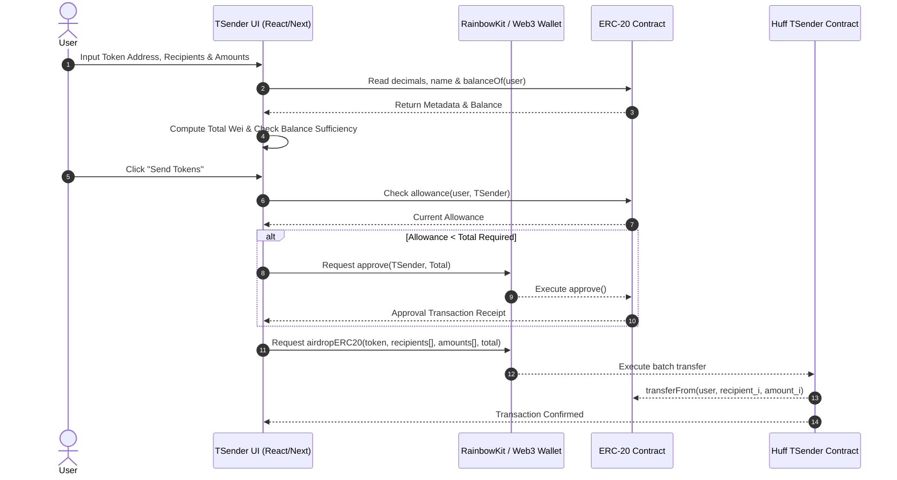
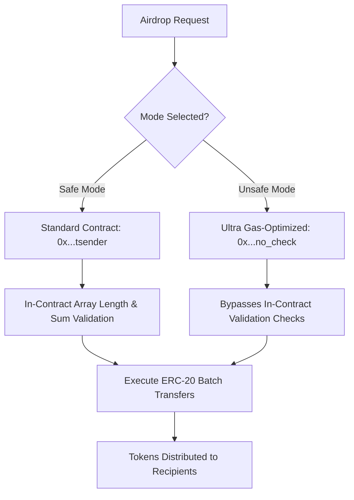

<div align="center">

  

  # 🐎 TSender UI

  **The most gas-efficient ERC-20 batch token airdrop interface on Earth, powered by Huff & Wagmi v2.**

  [](https://nextjs.org/)
  [](https://reactjs.org/)
  [](https://www.typescriptlang.org/)
  [](https://tailwindcss.com/)
  [](https://wagmi.sh/)
  [](https://rainbowkit.com/)
  [](https://vitest.dev/)
  [](https://playwright.dev/)

  [Key Features](#-key-features) •
  [Live Deployments](#-deployed-contract-registry) •
  [Architecture](#-architecture--workflow) •
  [Quick Start](#-quick-start) •
  [Testing](#-testing--quality-assurance) •
  [Directory Structure](#-project-structure)

</div>

---

## 🌟 Overview

**TSender UI** is a production-grade Web3 application for conducting mass ERC-20 token distributions (airdrops) with unmatched gas efficiency. Built to interface with the hyper-optimized **Huff-compiled TSender smart contracts**, TSender UI enables web3 projects, DAOs, and protocols to distribute tokens to hundreds of recipients in a single atomic transaction, saving up to **80% in gas fees** compared to standard Solidity implementations.

---

## ✨ Key Features

- ⚡ **Dual Gas Execution Modes**:
  - **Safe Mode**: Complete standard ERC-20 allowance and safety verification.
  - **Unsafe Mode**: Extreme gas-optimized mode skipping redundant in-contract validation checks for maximum gas savings.
- 🌐 **Multi-Chain Native**: Out-of-the-box support for Ethereum Mainnet, Arbitrum, Optimism, Base, zkSync Era, Sepolia, and local Anvil nodes.
- 🔄 **Automated 2-Step Allowance & Approval**: Seamless detection of current ERC-20 allowance with auto-triggered approval step before execution.
- 📊 **Real-Time Token Metadata & Balance Validation**: Automatic query of token `decimals`, `symbol`/`name`, and `balanceOf` to validate balance sufficiency before transaction broadcast.
- 💾 **State Persistence**: Automatic browser `localStorage` saving of inputs (token address, recipients, amounts) so user data is never lost on refresh.
- 🛡️ **Hydration-Safe SSR Architecture**: Leverages Next.js client-side dynamic imports (`ssr: false`) to completely eliminate Web3 SSR hydration mismatches.
- 🧪 **Enterprise Test Suite**: Unit testing via Vitest + JSDOM and E2E Web3 wallet automation with Playwright & Synpress v4.

---

## 📋 Deployed Contract Registry

| Network | Chain ID | Safe Contract (`tsender`) | Unsafe Contract (`no_check`) |
| :--- | :---: | :--- | :--- |
| 🔹 **Ethereum Mainnet** | `1` | `0x3aD9F29AB266E4828450B33df7a9B9D7355Cd821` | `0x7D4a746Cb398e5aE19f6cBDC08473664ADBc6da5` |
| 🔵 **Arbitrum One** | `42161` | `0xA2b5aEDF7EEF6469AB9cBD99DE24a6881702Eb19` | `0x091bAB6497F2Cc429c82c5807Df4faA34235Cccc` |
| 🔴 **Optimism** | `10` | `0xAaf523DF9455cC7B6ca5637D01624BC00a5e9fAa` | `0xa0c7ADA2c7c29729d12e2649BC6a0a293Ac46725` |
| 🔷 **Base Mainnet** | `8453` | `0x31801c3e09708549c1b2c9E1CFbF001399a1B9fa` | `0x39338138414Df90EC67dC2EE046ab78BcD4F56D9` |
| 🌀 **zkSync Era** | `324` | `0x7e645Ea4386deb2E9e510D805461aA12db83fb5E` | *N/A (Safe Only)* |
| 🧪 **Sepolia Testnet** | `11155111` | `0xa27c5C77DA713f410F9b15d4B0c52CAe597a973a` | `0xa27c5C77DA713f410F9b15d4B0c52CAe597a973a` |
| 🛠️ **Local Anvil** | `31337` | `0x5FbDB2315678afecb367f032d93F642f64180aa3` | `0x5FbDB2315678afecb367f032d93F642f64180aa3` |

---

## 🏗️ Architecture & Workflow

### 🔄 Web3 Transaction Execution Lifecycle



### ⚡ Safe vs. Unsafe Mode Comparison



---

## 🚀 Quick Start

### Prerequisites

- **Node.js**: `^18.18.0` or `^20.0.0`
- **pnpm**: `^9.0.0` (or `npm` / `yarn`)
- **WalletConnect Project ID**: Get one at [cloud.walletconnect.com](https://cloud.walletconnect.com)

### Installation

1. **Clone the repository**:
   ```bash
   git clone https://github.com/cyfrin/TSender-UI.git
   cd TSender-UI/ts-tsender-ui
   ```

2. **Install dependencies**:
   ```bash
   pnpm install
   ```

3. **Configure Environment Variables**:
   Create a `.env.local` file in `ts-tsender-ui/`:
   ```env
   NEXT_PUBLIC_WALLETCONNECT_PROJECT_ID=your_walletconnect_project_id
   ```

4. **Launch Development Server**:
   ```bash
   pnpm dev
   ```
   Navigate to `http://localhost:3000` in your web browser.

---

## 🧪 Testing & Quality Assurance

TSender UI enforces high reliability with a dual-layer test suite:

### 1. Unit & Integration Tests (Vitest)

Runs unit tests for calculation utilities, formatting helpers, and contract input parsing:

```bash
# Run unit tests
pnpm test:unit

# Run tests with code coverage report
pnpm coverage
```

### 2. E2E & Web3 Wallet Automation (Playwright + Synpress)

Runs headless browser integration tests interacting with mock Web3 wallets:

```bash
# Run Playwright E2E tests
pnpm test:e2e

# Cache Synpress wallet setup
pnpm test:cache
```

### 3. Local Anvil Testnet Node

Spin up a local Anvil node pre-loaded with deployed TSender contract state:

```bash
pnpm anvil
```

---

## 📁 Project Structure

```
ts-tsender-ui/
├── 📁 src/
│   ├── 📁 app/                    # Next.js 15 App Router
│   │   ├── 📄 globals.css          # Tailwind CSS v4 styles & theme settings
│   │   ├── 📄 layout.tsx           # Root HTML layout with Web3 providers wrapper
│   │   ├── 📄 page.tsx             # SSR-free dynamic entry point
│   │   └── 📄 providers.tsx        # Wagmi, QueryClient & RainbowKit provider configuration
│   ├── 📁 components/             # React UI components
│   │   ├── 📁 ui/                 # Atomic UI components (InputField, Tabs)
│   │   ├── 📄 AirdropForm.tsx      # Main batch token transfer form & allowance workflow
│   │   ├── 📄 Header.tsx           # Navigation bar with RainbowKit ConnectButton & GitHub link
│   │   └── 📄 HomeContent.tsx      # Main view switcher (Connected vs Disconnected)
│   ├── 📁 utils/                  # Pure utility functions with Vitest suites
│   │   ├── 📁 calculateTotal/     # Recipient amount summation & validation logic
│   │   └── 📁 formatTokenAmount/  # Decimal precision token display utility
│   ├── 📄 constants.ts            # Contract addresses map across chains & ERC-20/TSender ABIs
│   └── 📄 rainbowKitConfig.tsx    # Multi-chain network configuration (Mainnet, Arbitrum, etc.)
├── 📁 tests/                      # Automated test suite
│   ├── 📁 playwright/             # End-to-end browser specifications
│   └── 📁 wallet-setup/           # Synpress wallet state snapshots
├── 📄 playwright.config.ts        # Playwright test configuration & devServer runner
├── 📄 vitest.config.mts           # Vitest configuration with JSDOM environment
├── 📄 tsender-deploy.json         # Anvil deployment state fixture
└── 📄 package.json                # Project dependencies and script definitions
```

---

## 🔒 Security & Safe vs. Unsafe Modes

> [!CAUTION]
> **Understanding Unsafe Mode**:
> Unsafe Mode utilizes the `no_check` contract variant which intentionally strips contract-side array length matching and total summation checks to maximize gas efficiency.
> - **Safe Mode (Recommended for most users)**: Verifies calldata integrity inside the contract before executing transfers.
> - **Unsafe Mode (Advanced Users Only)**: Skips contract checks. Only use if your frontend or client scripts explicitly pre-validate calldata sum and array lengths.

---

## 🤝 Contributing & License

Contributions, issues, and feature requests are welcome!

Built as part of the **Cyfrin Full-Stack Web3 Curriculum**.

Distributed under the MIT License. See `LICENSE` for more information.
